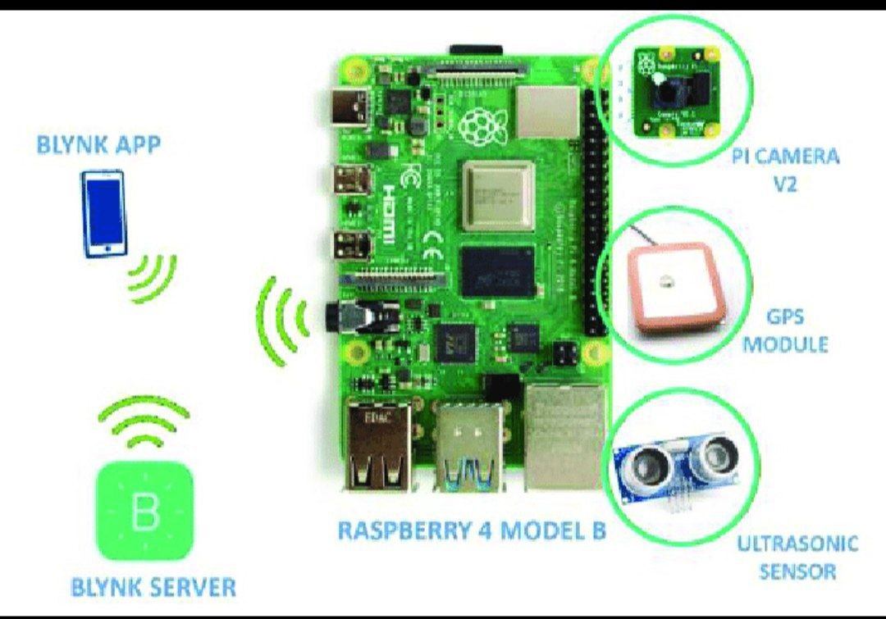
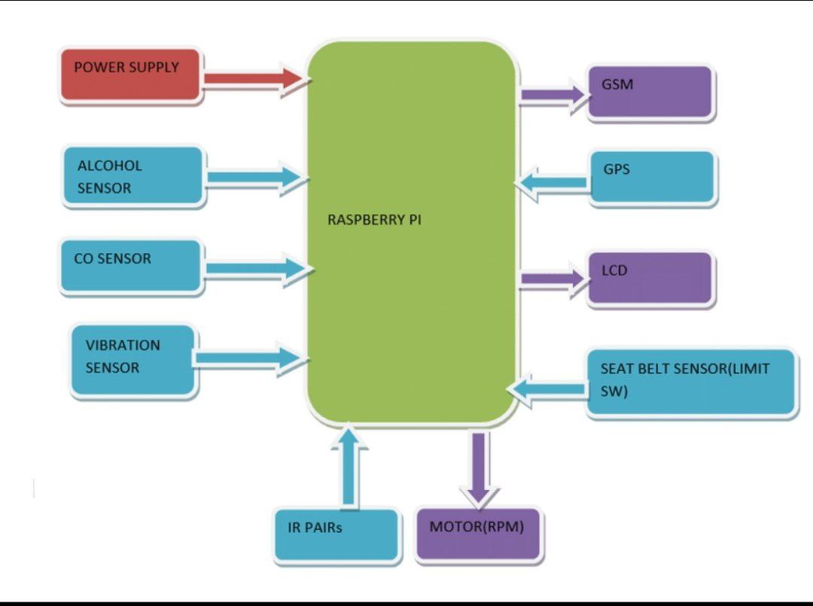

# Safe Driving System Using STM32 and Raspberry Pi

This project improves road safety by monitoring the driver and detecting alcohol consumption.

## Features

- Alcohol detection using MQ3 sensor
- Driver monitoring using Raspberry Pi camera
- Warning alert system
- Prevents drunk driving

## Hardware Used

STM32 Microcontroller  
Raspberry Pi  
MQ3 Alcohol Sensor  
Camera Module  
Buzzer / LED

## System Architecture

## Block Diagram

